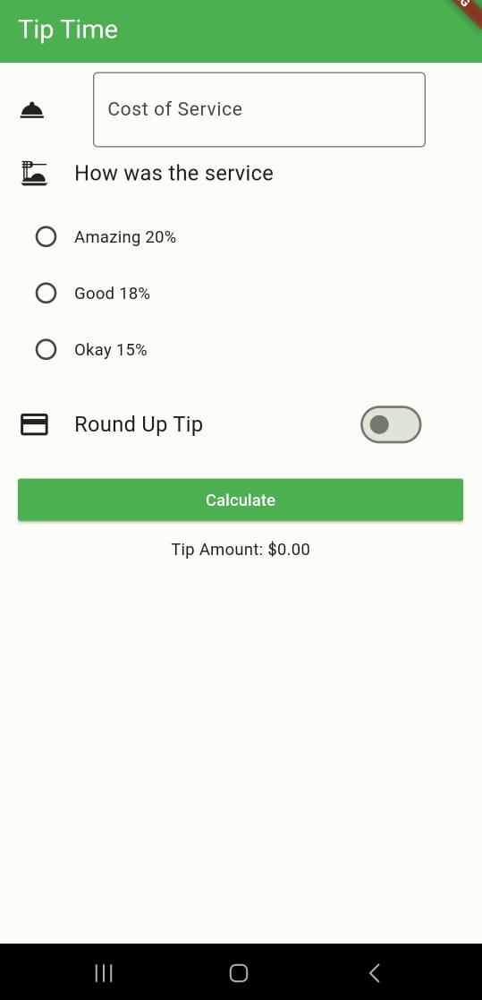
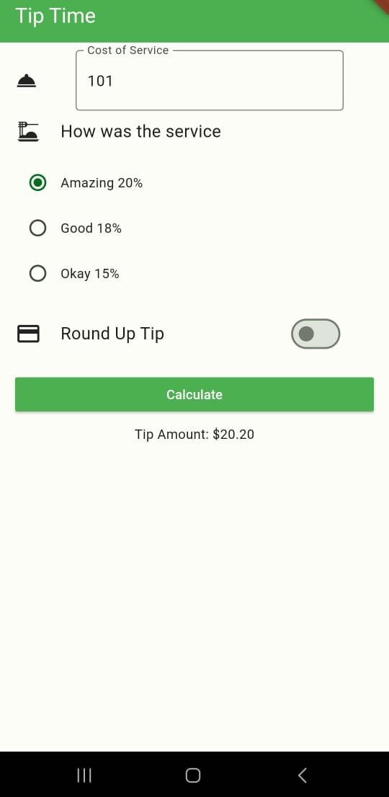
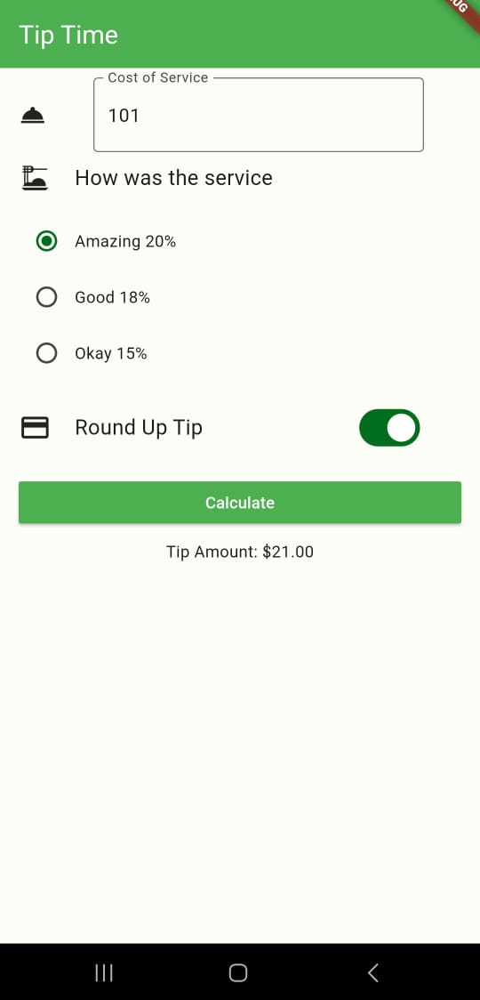

# tip_time
- Ayuda a calcular la propina en base al total del servicio,
- la calidad del servicio y si se desea redondear

- Provider
- Manejo de Widgets en general
- Principalmente en el widget Switch

## Lo que me costo mas trabajo
Durante este trabajo me costo la organizacion de los widgets para la primera fila
para colocar el icono y el campo de texto, pero se logro cuando se tuvo mas tiempo
para la entrega.
Tambien tarde un poco en entender el funcionamiento de Switch, ya que me dio varios
problemas al momento de cambiar el valor que usaba.

## Lo que aprendi
- Manejo del Widget de Switch
- Mejore mi comprension de un provider para identificar cuando y como usarlo

## Screenshots

